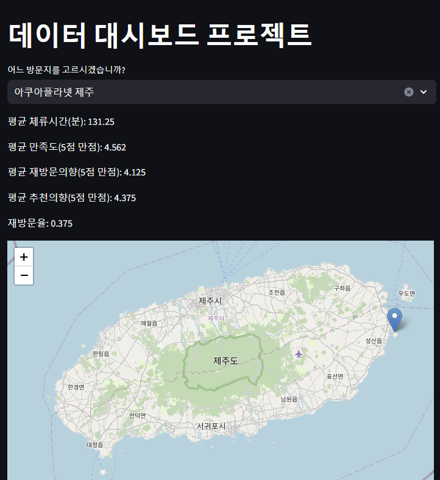
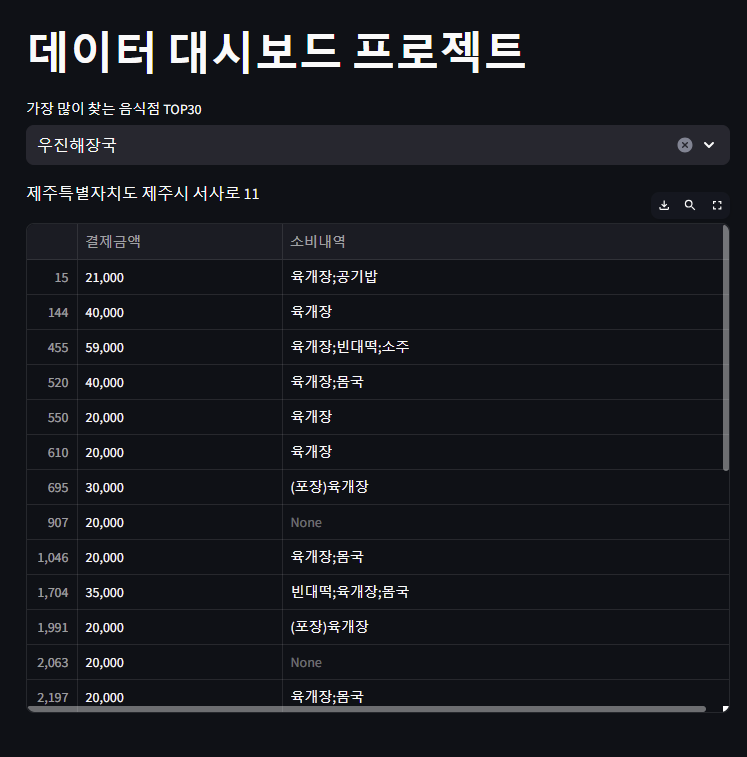
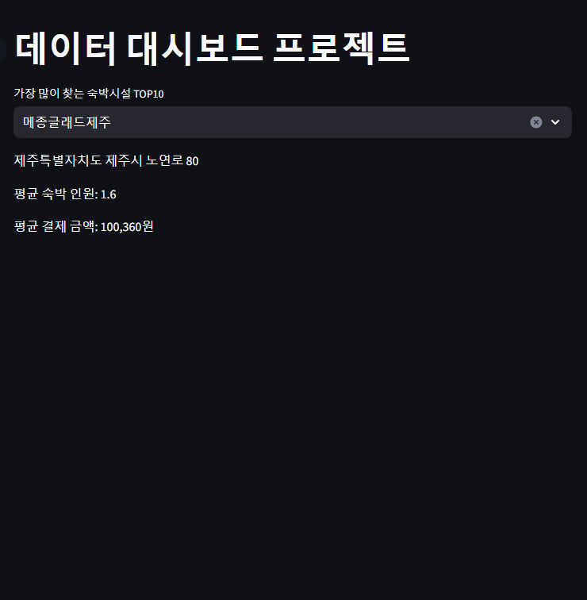
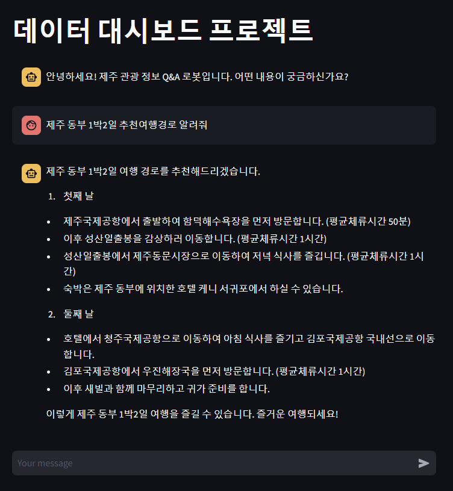

# data_dashboard_project
## 개요
2022년 대한민국 남부의 관광 데이터를 활용해 제주도의 유명식당,숙박 시설, 대표 관광지의 정보를 안내하는 서비스입니다. 
(https://jejuexplorer.streamlit.app/)

## 페이지 설명
### 1. home
- 2022년 한 해동안 관광객들이 많이 방문한 상위 40개의 관광지를 지도에 표현해 보았고 도로명주소와 평균 만족도를 제공합니다.

### 2. 대표 관광지 
- 관심있는 관광지 선택하면 지도에 그 관광지의 위치를 표시해주고 도로명주소,평균 체류시간, 평균 만족도, 평균 재방문의향, 평균 추천의향, 재방문율을 제공합니다.

### 3. 유명 식당
- 2022년 한 해동안 관광객들이 많이 방문한 상위 30개 식당들의 정보를 제공합니다. 
관심있는 식당을 선택하면 식당의 도로명주소와 사람들의 소비금액,소비내역을 알 수 있습니다.

### 4. 숙박 시설
- 2022년 한 해동안 관광객들이 많이 방문한 상위 10개 숙박 시설들의 정보를 제공합니다. 
관심있는 숙박 시설을 선택하면 도로명주소, 평균 숙박인원, 평균 결제 금액을 알 수 있습니다.

### 5. 챗봇
- 관광 데이터를 입력받은 AI가 여행에 관련된 정보를 제공합니다. 주로 추천여행경로를 제공합니다.

## 한계점
### 1. chatbot서비스에 입력할 수 있는 데이터 용량이 부족했습니다.
- 처음 챗봇을 만들기 위한 계획을 짰을 때는 csv파일인 방문지정보,숙박정보, 유명식당 정보를 string형태의 data로 바꿔 AI에 입력하려 했습니다. 하지만 이 모든것을 입력하기에는 입력할 수 있는 데이터의 용량이 부족했습니다. 따라서 상위 40개의 방문지 정보만 입력하기로 계획을 변경했습니다. 하지만 이 마저도 너무 큰 데이터였고 상위 40개의 방문지의 정보들을 평균내에 AI에 입력하게 되었습니다. 이로 인해 두가지의 아쉬운 점이 발생했습니다. 첫번째, 추천여행경로를 물어보면 식당과 숙박 시설의 대답이 빈약했습니다. 두번째, 추천여행경로를 물어보면 상위 40개의 관광지 위주로만 대답을 합니다.
하지만 두개의 아쉬운 점은 gpt를 구독하고 더 많은 데이터를 입력할 수 있으면 해결 할 수 있습니다. 

### 2. 유명 식당, 숙박 시설을 지도에 표현하기 힘들었습니다.
- 관광지정보 데이터에는 위도와 경도가 있었지만, 유명 식당, 숙박 시설데이터에는 위도와 경도가 없었습니다. 따라서 googlemap_api와 두개의 데이터의 도로명 주소를 활용해 위도와 경도를 구하려했습니다. 하지만 googlemap_api를 이용하려면 비용을 지불해야한다는 것을 알고 포기했습니다.

### 3. 데이터를 시각적으로 표현하는 데 아쉬움이 있었습니다.
- streamlit을 활용해 서비스를 구축했습니다. streamlit의 그래프들만으로 데이터를 표현하려 하다보니 불편한 점이 있었습니다.
대표적으로 숙박시설의 평균소비인원, 평균소비금액을 그래프로 표현하려 했지만 좌우의 y-label을 다르게 설정하는 것이 불가능해 포기했습니다. 
방문지정보의 평균만족도, 평균 재방문의향, 평균 추천의향을 y축의 제한된 범위안에서 누운 막대 그래프로 표현하려 했지만 이도 설정이 불가능해 포기했습니다. 
